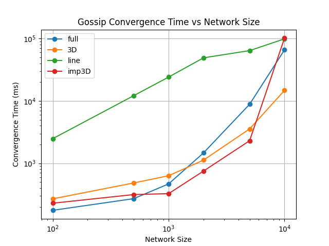
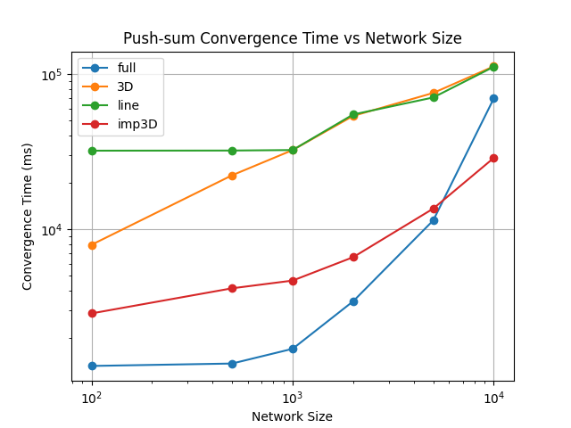
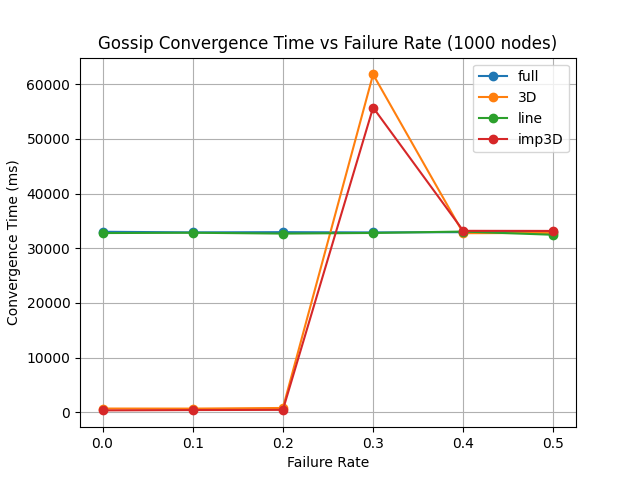
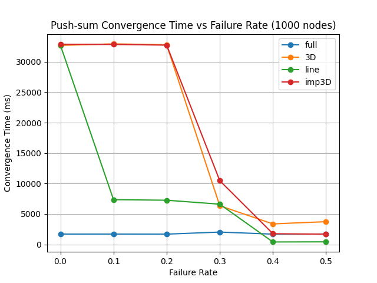

# Gossip and Push-Sum Protocol Simulator

A distributed systems simulator implementing Gossip and Push-Sum algorithms using Gleam's actor model. This project demonstrates rumor propagation and distributed average computation across various network topologies with optional failure simulation. This project is developed as part of the Distributed Operating System Principles (COP5615) course at the University of Florida.

## Features

- **Gossip Algorithm**: Rumor propagation with convergence detection
- **Push-Sum Algorithm**: Distributed average computation with ratio stability detection
- **Network Topologies**:
  - **Full**: Every node connected to all others
  - **3D Grid**: Nodes arranged in a 3D cube with adjacent neighbors
  - **Line**: Linear arrangement with at most 2 neighbors per node
  - **Imperfect 3D Grid**: 3D grid with one additional random connection per node
- **Failure Simulation**: Configurable message drop rate to simulate network failures
- **Actor-based Implementation**: Uses Gleam OTP for concurrent message processing
- **Convergence Timing**: Measures time to reach consensus across all nodes

## Requirements

- Gleam 1.12.0+
- Erlang/OTP 26+
- Python 3.8+ (for measurement scripts)

## Installation

1. Install Gleam: [https://gleam.run/getting-started/](https://gleam.run/getting-started/)
2. Clone the repository
3. Install dependencies:

   ```bash
   gleam deps download
   ```

## Usage

```bash
gleam run <num_nodes> <topology> <algorithm> <failure_rate>
```

### Parameters

| Parameter | Description | Valid Values |
|-----------|-------------|--------------|
| `num_nodes` | Number of nodes in the network | Any positive integer |
| `topology` | Network topology type | `full`, `3D`, `line`, `imp3D` |
| `algorithm` | Algorithm to run | `gossip`, `push-sum` |
| `failure_rate` | Probability of message drop (0.0 = no failures) | `0.0` to `1.0` |

### Examples

```bash
# Run gossip with 100 nodes in full topology, no failures
gleam run 100 full gossip 0.0

# Run push-sum with 27 nodes in 3D grid topology, no failures
gleam run 27 3D push-sum 0.0

# Run gossip with 1000 nodes and 10% message failure rate
gleam run 1000 line gossip 0.1

# Run push-sum with imperfect 3D grid and 20% failure rate
gleam run 64 imp3D push-sum 0.2
```

## Output

The program outputs the convergence time in milliseconds:

```text
1247
```

## Measurement Scripts

Two Python scripts are provided for automated performance analysis:

### Standard Performance Measurement

```bash
python measure.py
```

Runs simulations across different network sizes and topologies, saving results to `results.json` and generating convergence plots in the `plots/` folder.

### Failure Rate Analysis

```bash
python measure_failure.py
```

Measures the impact of different failure rates on convergence time, saving results to `results_failure.json` and generating failure analysis plots.

## Project Structure

```text
├── src/
│   ├── main.gleam          # Main entry point and CLI parsing
│   ├── gossip.gleam        # Gossip algorithm implementation
│   ├── push_sum.gleam      # Push-Sum algorithm implementation
│   ├── topology.gleam      # Network topology generators
│   └── utils.gleam         # Utility functions
├── test/
│   └── project2_test.gleam # Unit tests
├── measure.py              # Performance measurement script
├── measure_failure.py      # Failure rate analysis script
└── plots/                  # Generated visualization plots
```

## How It Works

### Gossip Algorithm

Each node starts without knowledge of the rumor. When a node receives the rumor, it begins spreading it to randomly selected neighbors. A node is considered converged once it has heard the rumor. The simulation completes when all nodes have received the rumor.

### Push-Sum Algorithm

Each node starts with initial values `s = node_id + 1` and `w = 1.0`. In each round, nodes send half of their `s` and `w` values to a random neighbor while keeping the other half. Nodes track the ratio `s/w` and are considered converged when this ratio remains stable (changes less than 10⁻¹⁰) for 3 consecutive rounds.

### Failure Model

When a non-zero failure rate is specified, each message has a probability of being dropped before delivery. This simulates network unreliability and allows testing algorithm resilience under adverse conditions.

## Performance Results

### Convergence Time vs Network Size

The following plots show how convergence time scales with network size for different topologies:

| Gossip Algorithm | Push-Sum Algorithm |
|:----------------:|:------------------:|
|  |  |

**Observations:**
- **Line topology** shows the slowest convergence due to limited connectivity
- **Full topology** scales well but has higher overhead for large networks
- **Imperfect 3D Grid** provides a good balance between connectivity and efficiency

### Failure Rate Impact

These plots demonstrate how message drop rates affect convergence time (tested with 1000 nodes):

| Gossip Algorithm | Push-Sum Algorithm |
|:----------------:|:------------------:|
|  |  |

**Observations:**
- **Gossip** is more resilient to failures due to its redundant message propagation
- **Push-Sum** convergence time decreases with higher failure rates as nodes reach stability faster with fewer updates
- **3D and Imperfect 3D** topologies show interesting behavior at moderate failure rates

